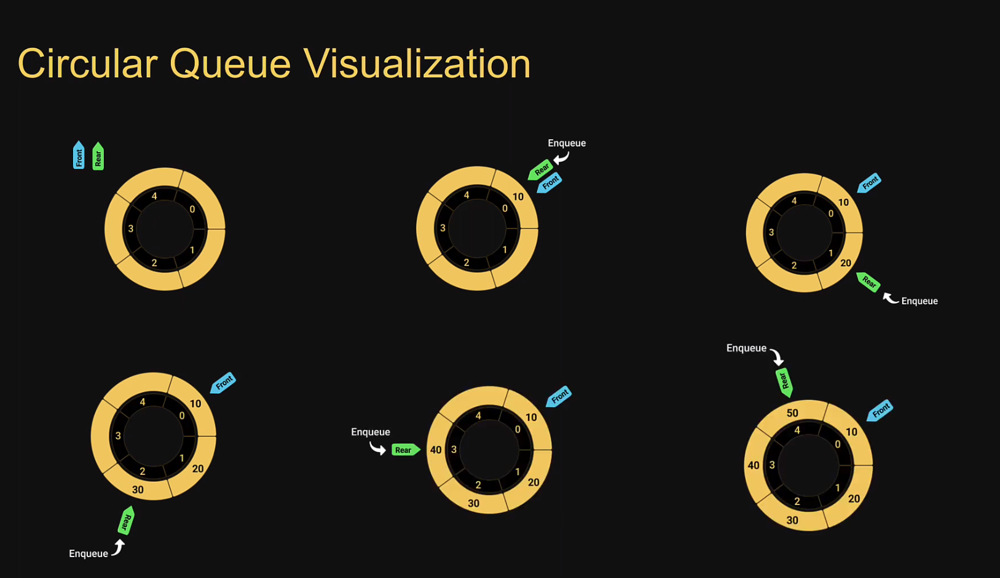
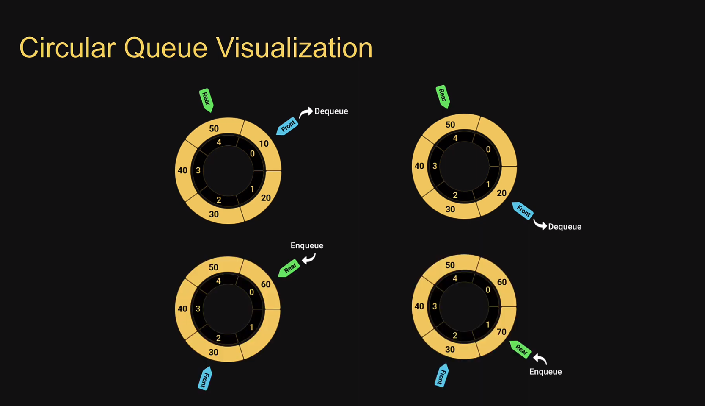

# Circular Queue

The size of the queue is fixed and a single block of memory is used as if the first element in connected to the last element. (큐의 크기는 고정되어 있으며, 첫 번째 요소가 마지막 요소에 연결된 것처럼 메모리의 단일 블록이 사용됩니다.)

Also referred to as circular buffer or ring buffer and follows the `FIFO` (원형 버퍼 또는 링 버퍼라고도 하며 'FIFO'를 따릅니다.)

A circular queue will `reuse` the empty block created during the `dequeue` operation (원형 큐는 `dequeue` 작업 중에 생성된 빈 블록을 `재사용` 합니다.)

When working with queues of fixed maximum size, a circular queue is a great implementation choice. (고정된 최대 크기의 큐로 작업할 때 원형 큐는 좋은 구현 선택입니다.)

The circular Queue data structure supports two main operations.

- `Enqueue`, which adds an element to the rear/tail of the collection
- `Dequeue`, which removes an element from the front/head of the collection

## Visualization

## Circular Queue Usage

- Clock

- Streaming data

- Traffic lights