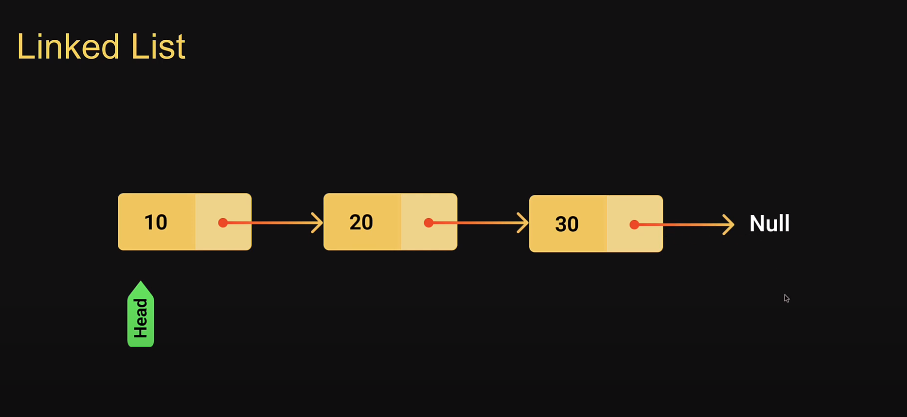

# Linked List

- A linked list is a linear data structure that includes a series of connected nodes

- Each node consists of a data value and a pointer that points to the next node

- The list elements can be easily inserted or removed without reallocation or reorganization of the entire structure
(List 요소는 전체 구조를 재할당하거나 재구성하지 않고도 쉽게 삽입 또는 제거할 수 있습니다.
)

- Random access of elements is not feasible and accessing an element has linear time complexity

- The linked list data structure supports three main operations.

    1. `Insertion` - to add an element at the beginning, end or at a given index in the list

    2. `Deletion` - to remove an item given it index or value

    3. `Search` - to find an element given its value

## Linked List Usage

- All applications of both stacks and queues are applications of linked lists

- Image viewer (slide)